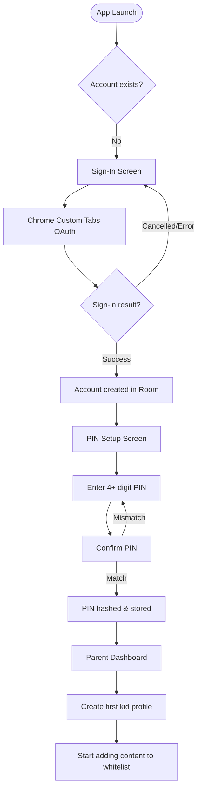
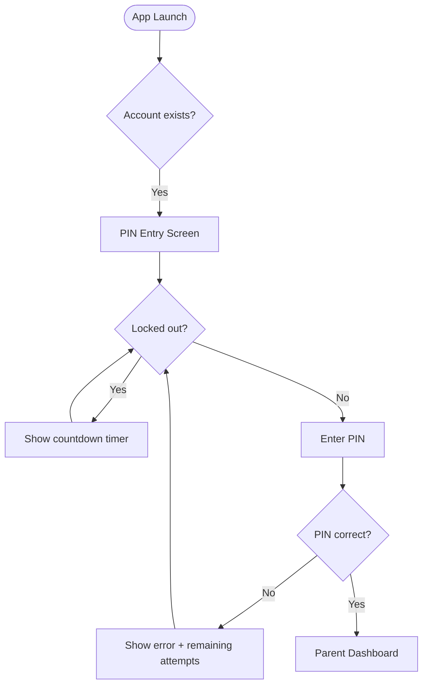
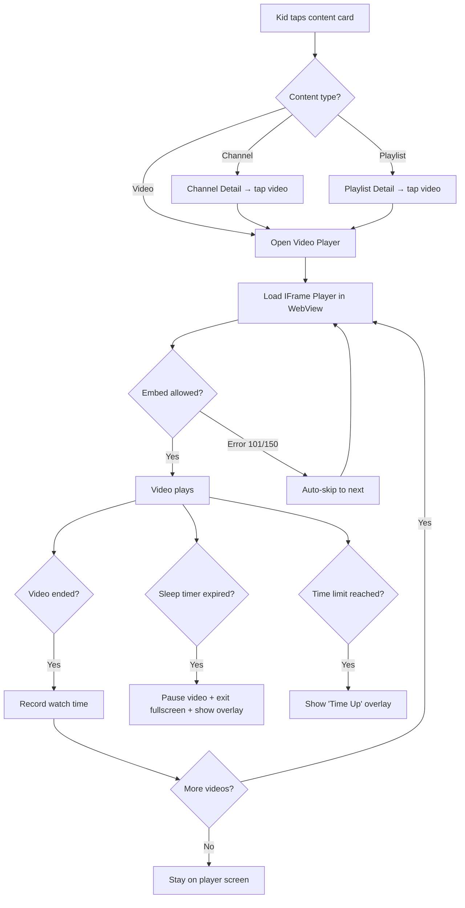
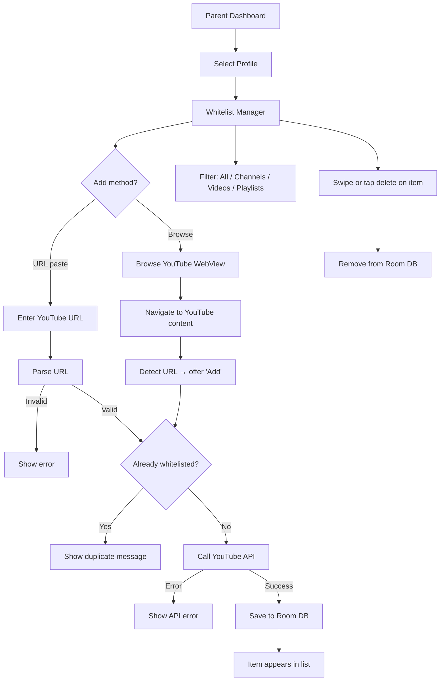
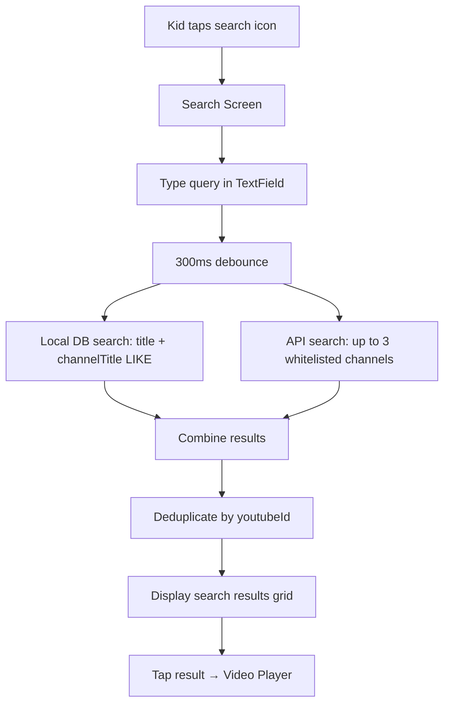

# Functional Specification (FS)

**Project**: YouTubeWhitelist
**Version**: 1.0.0
**Last Updated**: 2026-02-10

---

## Table of Contents

1. [Application Overview](#1-application-overview)
2. [User Roles](#2-user-roles)
3. [Screen Inventory](#3-screen-inventory)
4. [Functional Requirements](#4-functional-requirements)
5. [User Flows](#5-user-flows)
6. [UI State Specifications](#6-ui-state-specifications)
7. [Validation Rules](#7-validation-rules)
8. [Error Handling & User Feedback](#8-error-handling--user-feedback)

---

## 1. Application Overview

**YouTubeWhitelist** is a whitelist-based YouTube client for children. Parents curate a safe list of YouTube channels, videos, and playlists. Kids see only the whitelisted content — nothing else.

- **Platform**: Android (API 26+)
- **Target users**: Parents with children aged 3–12
- **Distribution**: Google Play Store, F-Droid, GitHub Releases
- **Privacy**: 100% client-side, no backend server, no analytics, no tracking
- **License**: GPLv3

---

## 2. User Roles

### Parent

- Full YouTube browsing access (WebView)
- Whitelist management (add/remove channels, videos, playlists)
- Profile management (create/edit/delete kid profiles)
- Settings: PIN, time limits, sleep timer, export/import
- Requires: Google Sign-In + PIN authentication

### Kid

- Restricted to whitelisted content only
- Grid-based content browsing
- Video playback with navigation controls
- Search within whitelisted content + whitelisted channel videos
- No access to settings, whitelist management, or external links
- Exit requires parent PIN

---

## 3. Screen Inventory

| # | Screen | Route | ViewModel | Module |
|---|--------|-------|-----------|--------|
| 1 | Sign-In | `Route.SignIn` | `SignInViewModel` | feature:parent |
| 2 | PIN Setup | `Route.PinSetup` | `PinSetupViewModel` | feature:parent |
| 3 | PIN Entry | `Route.PinEntry` | `PinEntryViewModel` | feature:parent |
| 4 | Parent Dashboard | `Route.ParentDashboard` | `ParentDashboardViewModel` | feature:parent |
| 5 | Profile Manager | `Route.ProfileManager` | `ProfileManagerViewModel` | feature:parent |
| 6 | Create/Edit Profile | (dialog) | `ProfileManagerViewModel` | feature:parent |
| 7 | Whitelist Manager | `Route.WhitelistManager` | `WhitelistManagerViewModel` | feature:parent |
| 8 | Browse YouTube | `Route.BrowseYouTube` | — (WebView) | feature:parent |
| 9 | Watch Statistics | `Route.WatchStats` | `WatchStatsViewModel` | feature:parent |
| 10 | Export/Import | `Route.ExportImport` | `ExportImportViewModel` | feature:parent |
| 11 | About | `Route.About` | — (static) | feature:parent |
| 12 | Change PIN | `Route.ChangePin` | `ChangePinViewModel` | feature:parent |
| 13 | Sleep Mode Setup | `Route.SleepMode` | `SleepModeViewModel` | feature:sleep |
| 14 | Kid Home | `Route.KidHome` | `KidHomeViewModel` | feature:kid |
| 15 | Video Player | `Route.VideoPlayer` | `VideoPlayerViewModel` | feature:kid |
| 16 | Channel Detail | `Route.ChannelDetail` | `ChannelDetailViewModel` | feature:kid |
| 17 | Playlist Detail | `Route.PlaylistDetail` | `PlaylistDetailViewModel` | feature:kid |
| 18 | Kid Search | `Route.KidSearch` | `KidSearchViewModel` | feature:kid |

---

## 4. Functional Requirements

### FR-01: User Authentication

| ID | Requirement |
|----|------------|
| FR-01.1 | Users authenticate via Google OAuth 2.0 (Chrome Custom Tabs) |
| FR-01.2 | On successful sign-in, the app stores access token, refresh token, and user info |
| FR-01.3 | Session persists across app restarts (tokens in EncryptedSharedPreferences) |
| FR-01.4 | Sign-out clears all tokens and deletes the parent account from the database |
| FR-01.5 | Auth state is observable: Loading → Authenticated / Unauthenticated |

### FR-02: PIN Security

| ID | Requirement |
|----|------------|
| FR-02.1 | Parents must set a 4+ digit PIN after first sign-in |
| FR-02.2 | PIN is hashed with PBKDF2 (120k iterations, 256-bit key) before storage |
| FR-02.3 | PIN is required to access Parent Dashboard from Kid mode |
| FR-02.4 | After 5 failed attempts, lockout activates (30s, escalating exponentially) |
| FR-02.5 | Lockout shows countdown timer with remaining seconds |
| FR-02.6 | PIN can be changed from Parent Dashboard (requires old PIN verification) |
| FR-02.7 | Successful PIN entry resets the brute force counter |

### FR-03: Profile Management

| ID | Requirement |
|----|------------|
| FR-03.1 | Parents can create multiple kid profiles (name + optional avatar URL) |
| FR-03.2 | Each profile has independent whitelist and watch history |
| FR-03.3 | Profiles can be edited (name, avatar, daily time limit, sleep playlist) |
| FR-03.4 | Profiles can be deleted (cascade deletes all whitelist items and watch history) |
| FR-03.5 | Profile count is displayed on the Parent Dashboard |

### FR-04: Whitelist Management

| ID | Requirement |
|----|------------|
| FR-04.1 | Parents add content by pasting a YouTube URL |
| FR-04.2 | Parents add content via Browse YouTube WebView (URL detection) |
| FR-04.3 | Supported content types: Channel, Video, Playlist |
| FR-04.4 | URL is parsed, validated, and resolved via YouTube API |
| FR-04.5 | Duplicate items are detected before API call (by YouTube ID) and rejected |
| FR-04.6 | Whitelist can be filtered by type (All, Channels, Videos, Playlists) |
| FR-04.7 | Individual items can be removed from the whitelist |
| FR-04.8 | Item count is displayed per profile |

**Supported URL formats**: `youtube.com/watch?v=`, `youtu.be/`, `youtube.com/channel/`, `youtube.com/@handle`, `youtube.com/c/name`, `youtube.com/playlist?list=`, `youtube.com/shorts/`, `youtube.com/embed/`, `youtube.com/live/`

### FR-05: Kid Mode Home

| ID | Requirement |
|----|------------|
| FR-05.1 | Displays whitelisted content in a grid layout |
| FR-05.2 | Content organized in sections: Channels, Videos, Playlists |
| FR-05.3 | Each card shows: thumbnail, title, channel name (for videos) |
| FR-05.4 | Tapping a channel opens Channel Detail view |
| FR-05.5 | Tapping a video opens Video Player |
| FR-05.6 | Tapping a playlist opens Playlist Detail view |
| FR-05.7 | Lock FAB allows exit to parent mode (requires PIN) |
| FR-05.8 | "Good Night" overlay appears when sleep timer expires |
| FR-05.9 | "Time's Up" overlay appears when daily time limit is reached |

### FR-06: Video Playback

| ID | Requirement |
|----|------------|
| FR-06.1 | Videos play via YouTube IFrame Player API in a WebView |
| FR-06.2 | Player controls: play/pause, fullscreen, next/previous |
| FR-06.3 | Video auto-plays on load |
| FR-06.4 | Next/Previous navigation cycles through the current content list |
| FR-06.5 | Videos with embedding disabled (error 101/150) are automatically skipped |
| FR-06.6 | All navigation within the WebView is blocked (no "Watch on YouTube" links) |
| FR-06.7 | Watch time is recorded when a video ends |
| FR-06.8 | Sleep timer overlay pauses video and exits fullscreen |

### FR-07: Search

| ID | Requirement |
|----|------------|
| FR-07.1 | Search input with 300ms debounce |
| FR-07.2 | Local search: matches whitelist item titles and channel titles (SQL LIKE) |
| FR-07.3 | API search: searches within whitelisted channels' videos via YouTube Search API |
| FR-07.4 | Maximum 3 channels searched per query (quota protection: 300 units max) |
| FR-07.5 | Results deduplicated by YouTube ID (local takes precedence) |
| FR-07.6 | API search results displayed with "search-" ID prefix to prevent key conflicts |
| FR-07.7 | TextField shows immediate input state; results use debounced state |

### FR-08: Channel & Playlist Browsing

| ID | Requirement |
|----|------------|
| FR-08.1 | Channel Detail shows all whitelisted videos from that channel |
| FR-08.2 | Playlist Detail fetches and displays playlist items via YouTube API |
| FR-08.3 | Playlist items are paginated (50 per page) |
| FR-08.4 | Tapping any item navigates to Video Player |

### FR-09: Sleep Timer

| ID | Requirement |
|----|------------|
| FR-09.1 | Parents configure sleep duration (in minutes) for a kid profile |
| FR-09.2 | Timer runs as a background countdown (1-second intervals) |
| FR-09.3 | Timer state persists across screen navigation (singleton manager) |
| FR-09.4 | When timer expires, "Good Night" overlay appears on Kid Home and Video Player |
| FR-09.5 | Overlay shows lock icon and dark theme |
| FR-09.6 | Video is paused and fullscreen is exited when overlay appears |
| FR-09.7 | Parent PIN dismisses the overlay and stops the timer |
| FR-09.8 | Timer displays formatted remaining time ("Xh Ym" or "Xm") |

### FR-10: Daily Time Limits

| ID | Requirement |
|----|------------|
| FR-10.1 | Parents set an optional daily limit per profile (in minutes) |
| FR-10.2 | Watch time is tracked in real-time via Room Flow |
| FR-10.3 | When limit is reached, "Time's Up" overlay appears |
| FR-10.4 | Null limit means unlimited watching |
| FR-10.5 | Time resets at midnight (system timezone) |

### FR-11: Watch Statistics

| ID | Requirement |
|----|------------|
| FR-11.1 | Dashboard shows total watch time per profile |
| FR-11.2 | Statistics screen shows daily/weekly/monthly breakdown |
| FR-11.3 | Unique video count displayed per time period |
| FR-11.4 | Daily breakdown aggregated via SQL GROUP BY |

### FR-12: Export/Import

| ID | Requirement |
|----|------------|
| FR-12.1 | Export serializes all profiles and whitelist items to JSON |
| FR-12.2 | Export format includes version number and timestamp |
| FR-12.3 | Import supports two strategies: MERGE and OVERWRITE |
| FR-12.4 | MERGE keeps existing data, skips duplicate items |
| FR-12.5 | OVERWRITE deletes all existing data before importing |
| FR-12.6 | Import generates new UUIDs for all entities (prevents PK conflicts) |
| FR-12.7 | Import result shows count of profiles imported, items imported, items skipped |

### FR-13: Screen Pinning (Kiosk Mode)

| ID | Requirement |
|----|------------|
| FR-13.1 | Kid mode activates Android Lock Task Mode (screen pinning) |
| FR-13.2 | System navigation buttons are disabled |
| FR-13.3 | Home and Recent apps buttons are blocked |
| FR-13.4 | Exiting kiosk mode requires parent PIN |

### FR-14: WebView Browser

| ID | Requirement |
|----|------------|
| FR-14.1 | Full YouTube browsing experience for parents |
| FR-14.2 | YouTube login session persists (CookieManager) |
| FR-14.3 | YouTube Premium recognized (third-party cookies enabled) |
| FR-14.4 | URL detection for one-tap "Add to Whitelist" |
| FR-14.5 | Cookies flushed to disk on WebView dispose |

### FR-15: About Screen

| ID | Requirement |
|----|------------|
| FR-15.1 | Shows app name and version number |
| FR-15.2 | Shows app description |
| FR-15.3 | Shows GPLv3 license info |
| FR-15.4 | Clickable GitHub repository link |
| FR-15.5 | Ko-fi donation card with external link |

---

## 5. User Flows

### First-Time Setup

### Returning User

### Video Playback Flow

### Whitelist Management Flow

### Search & Discovery Flow

---

## 6. UI State Specifications

### ParentDashboardUiState

| Field | Type | Description |
|-------|------|-------------|
| `account` | `ParentAccount?` | Current parent account |
| `profiles` | `List<KidProfile>` | All kid profiles |
| `isLoading` | `Boolean` | Loading indicator |

### WhitelistManagerUiState

| Field | Type | Description |
|-------|------|-------------|
| `items` | `List<WhitelistItem>` | Displayed whitelist items |
| `filterType` | `WhitelistItemType?` | Active filter (null = all) |
| `itemCount` | `Int` | Total items for profile |
| `isLoading` | `Boolean` | Loading indicator |
| `error` | `String?` | Error message |
| `addResult` | `AppResult<WhitelistItem>?` | Result of last add operation |

### KidHomeUiState

| Field | Type | Description |
|-------|------|-------------|
| `channels` | `List<WhitelistItem>` | Whitelisted channels |
| `videos` | `List<WhitelistItem>` | Whitelisted videos |
| `playlists` | `List<WhitelistItem>` | Whitelisted playlists |
| `isLoading` | `Boolean` | Loading indicator |
| `isSleepTimerExpired` | `Boolean` | Sleep timer overlay trigger |
| `isTimeLimitReached` | `Boolean` | Time limit overlay trigger |

### VideoPlayerUiState

| Field | Type | Description |
|-------|------|-------------|
| `currentVideo` | `WhitelistItem?` | Currently playing video |
| `videoList` | `List<WhitelistItem>` | Navigation list |
| `currentIndex` | `Int` | Position in list |
| `isSleepTimerExpired` | `Boolean` | Sleep timer overlay trigger |

### KidSearchUiState

| Field | Type | Description |
|-------|------|-------------|
| `query` | `String` | Current search text (non-debounced) |
| `results` | `List<WhitelistItem>` | Combined local + API results |
| `isSearching` | `Boolean` | API search in progress |

### SleepModeUiState

| Field | Type | Description |
|-------|------|-------------|
| `timerStatus` | `SleepTimerStatus` | IDLE / RUNNING / EXPIRED |
| `remainingFormatted` | `String` | "Xh Ym" display |

---

## 7. Validation Rules

| Field | Rule | Error Message |
|-------|------|---------------|
| PIN | Minimum 4 digits, digits only | "PIN must be at least 4 digits" |
| PIN Confirm | Must match first entry | "PINs do not match" |
| Profile Name | Non-empty, trimmed | "Profile name is required" |
| YouTube URL | Must parse to valid YouTubeContent | "Invalid YouTube URL" |
| Time Limit | Positive integer or null | "Enter a valid number of minutes" |
| Sleep Duration | Positive integer (minutes) | "Enter a valid duration" |

---

## 8. Error Handling & User Feedback

### Snackbar Messages

| Scenario | Message | Action |
|----------|---------|--------|
| Item added to whitelist | "Added: {title}" | Dismiss |
| Duplicate item | "Already whitelisted" | Dismiss |
| Invalid URL | "Invalid YouTube URL" | Dismiss |
| API error | "Failed to load content" | Retry |
| Network error | "Network error — check your connection" | Retry |
| Export success | "Exported {n} profiles" | Dismiss |
| Import success | "Imported {n} profiles, {m} items" | Dismiss |
| PIN lockout | "Too many attempts. Try again in {n}s" | Dismiss |

### Loading States

| Screen | Loading Indicator |
|--------|------------------|
| Whitelist Manager | CircularProgressIndicator during URL resolution |
| Kid Home | Skeleton placeholder while Room query loads |
| Video Player | WebView loading animation |
| Playlist Detail | CircularProgressIndicator during API fetch |
| Export/Import | CircularProgressIndicator during file I/O |

### Retry Mechanisms

| Operation | Retry Strategy |
|-----------|---------------|
| YouTube API call | Manual retry via snackbar action |
| Video embed error | Automatic skip to next video |
| OAuth timeout | Re-initiate sign-in flow |
| Token refresh | Automatic on 401 response |
