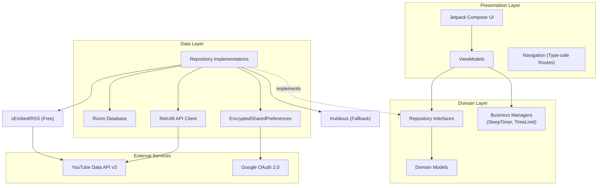
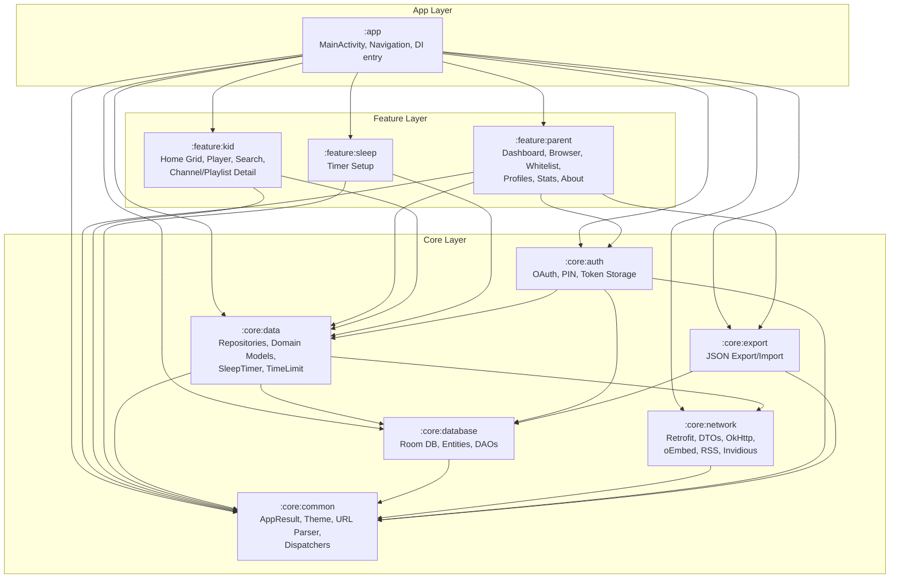
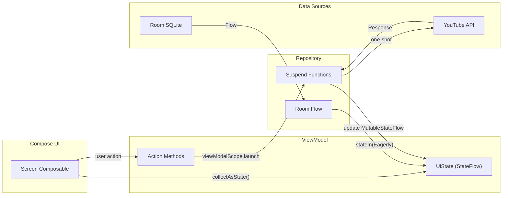
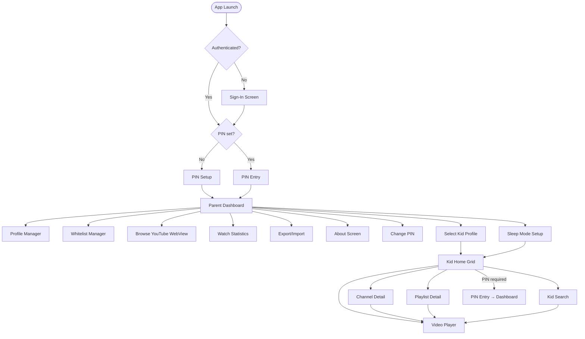
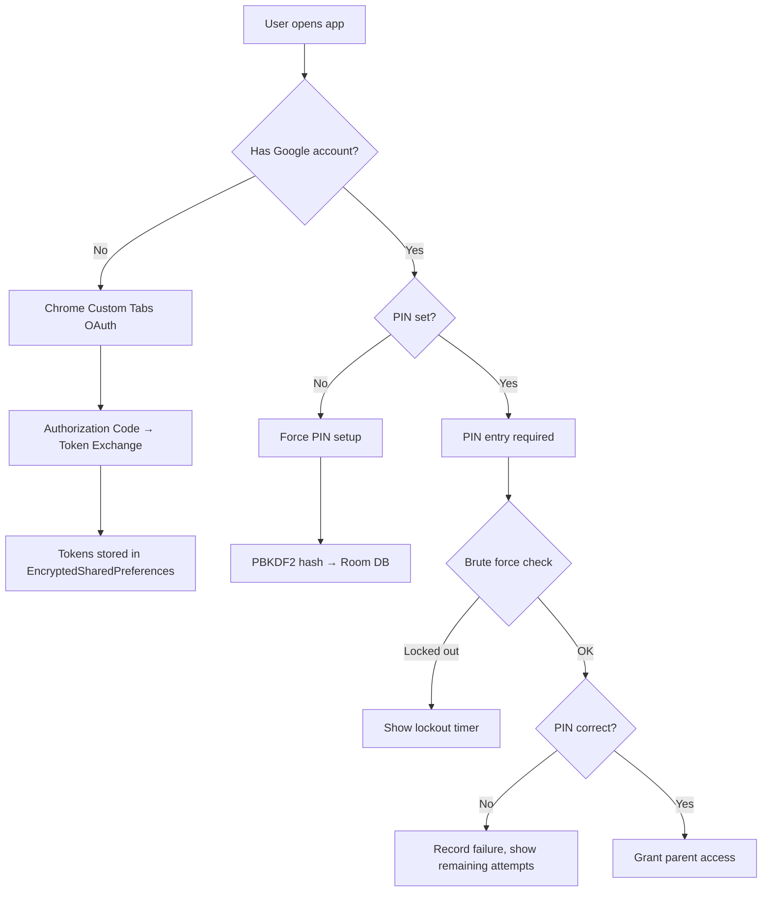
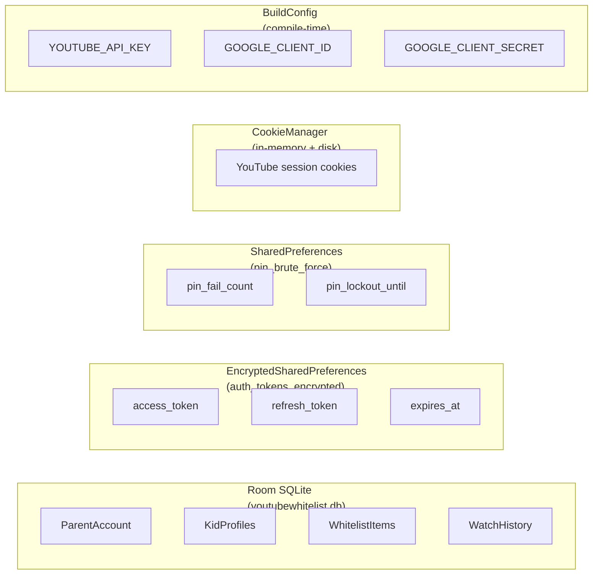
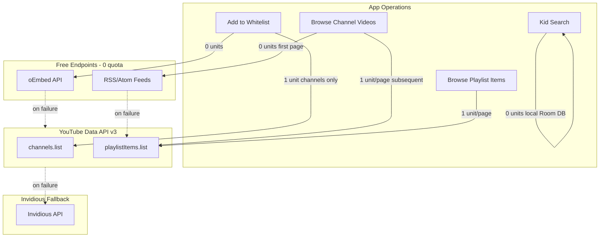
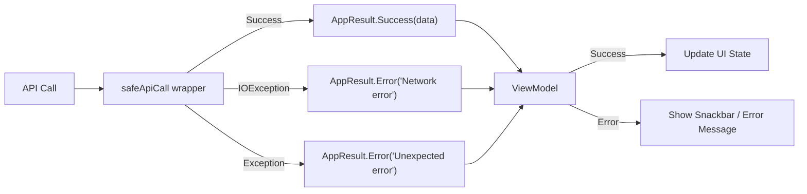

# High-Level Design (HLD)

**Project**: YouTubeWhitelist
**Version**: 1.1.0
**Last Updated**: 2026-02-10

---

## Table of Contents

1. [System Architecture Overview](#1-system-architecture-overview)
2. [Module Architecture](#2-module-architecture)
3. [Technology Stack](#3-technology-stack)
4. [Data Flow Architecture](#4-data-flow-architecture)
5. [Navigation Architecture](#5-navigation-architecture)
6. [Security Architecture](#6-security-architecture)
7. [Data Storage Strategy](#7-data-storage-strategy)
8. [External API Integration](#8-external-api-integration)
9. [Build & Release Pipeline](#9-build--release-pipeline)
10. [Error Handling Strategy](#10-error-handling-strategy)

---

## 1. System Architecture Overview

The application follows a layered MVVM + Clean Architecture pattern with strict module boundaries.



### Architecture Principles

- **Unidirectional data flow**: UI ← ViewModel ← Repository ← Data Source
- **Dependency inversion**: Feature modules depend on interfaces, not implementations
- **Module isolation**: Feature modules cannot depend on each other
- **Reactive updates**: Room `Flow` propagates DB changes to UI automatically

---

## 2. Module Architecture



### Module Responsibility Matrix

| Module | Layer | Responsibilities |
|--------|-------|-----------------|
| `:app` | App | Activity, navigation graph, Hilt entry point, API key provision |
| `:feature:parent` | Feature | Parent-facing screens: dashboard, whitelist CRUD, profile management, stats, WebView browser, about |
| `:feature:kid` | Feature | Kid-facing screens: content grid, video player, search, channel/playlist browsing |
| `:feature:sleep` | Feature | Sleep timer setup screen |
| `:core:common` | Core | Shared utilities, error types, enums, URL parser, Compose theme, dispatcher qualifiers |
| `:core:data` | Core | Repository interfaces + implementations, domain models, business logic managers |
| `:core:database` | Core | Room database, entity classes, DAO interfaces |
| `:core:network` | Core | Retrofit service, DTO classes, OkHttp configuration, oEmbed service, RSS parser, Invidious API client |
| `:core:auth` | Core | OAuth flow, PIN security, token storage, brute force protection |
| `:core:export` | Core | JSON serialization/deserialization for data backup and restore |

---

## 3. Technology Stack

| Category | Library | Version | Purpose |
|----------|---------|---------|---------|
| **Language** | Kotlin | 2.1.0 | Primary language |
| **Build** | Android Gradle Plugin | 8.7.3 | Build system |
| **Min SDK** | Android 8.0 | API 26 | Minimum supported version |
| **Target SDK** | Android 15 | API 35 | Target version |
| **UI** | Jetpack Compose BOM | 2025.01.01 | Declarative UI |
| **Design** | Material Design 3 | 1.3.1 | UI components + theming |
| **Navigation** | Navigation Compose | 2.8.6 | Type-safe navigation |
| **DI** | Hilt | 2.53.1 | Dependency injection |
| **Database** | Room | 2.7.0 | SQLite abstraction |
| **Network** | Retrofit | 2.11.0 | HTTP client |
| **HTTP** | OkHttp | 4.12.0 | HTTP engine |
| **Serialization** | kotlinx-serialization | 1.7.3 | JSON parsing |
| **Images** | Coil | 2.7.0 | Image loading + caching |
| **Auth** | Chrome Custom Tabs | 1.8.0 | OAuth flow |
| **Security** | Security Crypto | 1.1.0-alpha06 | Encrypted storage |
| **Coroutines** | kotlinx-coroutines | 1.9.0 | Async programming |
| **Annotation** | KSP | 2.1.0-1.0.29 | Compile-time code generation |
| **Testing** | JUnit + MockK + Truth + Turbine | Various | Unit testing |
| **Testing** | Robolectric | 4.14.1 | Android unit tests |

---

## 4. Data Flow Architecture

### MVVM Pattern



### Reactive Data Flow (Room → UI)

1. Room DAO returns `Flow<List<Entity>>`
2. Repository maps entities to domain models via `.map { it.toDomain() }`
3. ViewModel combines flows via `combine()` and exposes `StateFlow<UiState>`
4. Compose UI collects via `collectAsStateWithLifecycle()`
5. Any database change automatically propagates to UI

### One-Shot API Calls

1. User action triggers ViewModel method
2. ViewModel launches coroutine in `viewModelScope`
3. Repository calls Retrofit service (suspend function)
4. Result wrapped in `AppResult<T>` (Success or Error)
5. ViewModel updates `MutableStateFlow` with result

---

## 5. Navigation Architecture

### Screen Flow



### Route Parameters

All routes use Kotlinx Serialization for type-safe navigation:

| Route | Parameters | Module |
|-------|-----------|--------|
| `Route.SignIn` | — | app |
| `Route.PinSetup` | — | app |
| `Route.PinEntry` | — | app |
| `Route.ParentDashboard` | — | app |
| `Route.ProfileManager` | — | app |
| `Route.WhitelistManager(profileId)` | `profileId: String` | app |
| `Route.BrowseYouTube(profileId)` | `profileId: String` | app |
| `Route.WatchStats(profileId)` | `profileId: String` | app |
| `Route.ExportImport` | — | app |
| `Route.About` | — | app |
| `Route.ChangePin` | — | app |
| `Route.SleepMode(profileId)` | `profileId: String` | app |
| `Route.KidHome(profileId)` | `profileId: String` | app |
| `Route.VideoPlayer(profileId, videoId)` | `profileId: String, videoId: String` | app |
| `Route.ChannelDetail(profileId, channelTitle)` | `profileId: String, channelTitle: String` | app |
| `Route.PlaylistDetail(profileId, playlistId)` | `profileId: String, playlistId: String` | app |
| `Route.KidSearch(profileId)` | `profileId: String` | app |

---

## 6. Security Architecture

### Authentication Layers



### Data Protection Layers

| Layer | What | How |
|-------|------|-----|
| **Authentication** | Google account ownership | OAuth 2.0 via Chrome Custom Tabs |
| **Authorization** | Parent vs Kid access | PIN gate (PBKDF2, 120k iterations) |
| **Token security** | OAuth tokens at rest | EncryptedSharedPreferences (AES256-GCM) |
| **Brute force** | PIN guessing attacks | Exponential lockout (30s × 2^tier) |
| **WebView sandbox** | Kid video player | `shouldOverrideUrlLoading = true`, no file/content access |
| **Kiosk mode** | App escape prevention | Android Screen Pinning (Lock Task Mode) |
| **API key** | YouTube API credential | BuildConfig (compile-time), stripped from logs in release |

---

## 7. Data Storage Strategy



| Storage | Data | Encrypted | Lifecycle |
|---------|------|-----------|-----------|
| Room SQLite | Accounts, profiles, whitelist, watch history | No (device-level encryption) | Persistent |
| EncryptedSharedPreferences | OAuth tokens | Yes (AES256-GCM) | Persistent |
| SharedPreferences | Brute force counters | No | Persistent |
| CookieManager | YouTube login session | No | Persistent (flushed on dispose) |
| BuildConfig | API credentials | No (compiled into APK) | Compile-time |

---

## 8. External API Integration

### Hybrid Network Architecture (Strategy E)

Since v1.1.0, the app uses a hybrid approach with multiple data sources to minimize YouTube API quota consumption:



### Fallback Chain

| Operation | Free | YouTube API | Invidious |
|-----------|------|-------------|-----------|
| Get video metadata | oEmbed | videos.list | /api/v1/videos |
| Get playlist metadata | oEmbed | playlists.list | /api/v1/playlists |
| Get channel metadata | — | channels.list | /api/v1/channels |
| Resolve @handle | — | channels.list (forHandle) | /api/v1/resolveurl |
| List channel videos | RSS (first page, max 15) | playlistItems.list | /api/v1/channels |
| Kid search | Room DB (local-only) | — | — |

### Quota Management Strategy

- **Daily quota**: 10,000 units
- **Most operations now cost 0 units** (oEmbed/RSS free endpoints)
- **Kid search**: Local Room DB only (0 quota, removed YouTube Search API in v1.1.0)
- **Channel browsing**: First page via RSS (0 quota), subsequent pages via API (1 unit/page)
- **Mitigations**:
  - Check DB for duplicates BEFORE calling API
  - `getYoutubeIdsByType()` returns only IDs for lightweight duplicate checks
  - Built-in fallback API key for F-Droid builds
  - Invidious fallback on API failure (round-robin instances, health tracking)

---

## 9. Build & Release Pipeline

### Build Variants

| Variant | `minifyEnabled` | `shrinkResources` | Signing | Suffix |
|---------|----------------|-------------------|---------|--------|
| **debug** | `false` | `false` | Debug keystore | `.debug` |
| **release** | `true` | `true` | Release keystore | — |

### Release Build Configuration

- **Signing**: RSA 2048-bit keystore, credentials in `local.properties` (git-ignored)
- **R8 minification**: Full with custom ProGuard rules (see [LLD §10](LLD.md#10-proguardr8-rules))
- **Resource shrinking**: Enabled (removes unused resources)
- **Dual output**: APK (2.4 MB) for F-Droid/GitHub + AAB (5.2 MB) for Play Store

### Build Commands

```bash
# Debug APK
./gradlew assembleDebug

# Release APK
./gradlew assembleRelease

# Release AAB (Play Store)
./gradlew bundleRelease
```

### Distribution Channels

| Channel | Format | Metadata |
|---------|--------|----------|
| Google Play Store | AAB | Triple-T format (`fastlane/metadata/android/`) |
| F-Droid | APK | Triple-T format, `AntiFeature: NonFreeNet` |
| GitHub Releases | APK | `CHANGELOG.md` |

---

## 10. Error Handling Strategy

### AppResult\<T\> Pattern

All network operations return `AppResult<T>`:



### Error Handling by Layer

| Layer | Strategy | Example |
|-------|----------|---------|
| **Network** | `safeApiCall {}` wrapper catches IOException/Exception → `AppResult.Error` | API timeout → "Network error" |
| **Repository** | Validate input, check duplicates, wrap errors | Invalid URL → "Invalid YouTube URL" |
| **ViewModel** | Pattern-match `AppResult`, update UI state | Error → show snackbar |
| **UI** | Display error messages, retry buttons, loading states | Snackbar with error text |

### Specific Error Scenarios

| Scenario | Handling |
|----------|---------|
| Video embedding disabled (errors 101/150) | Auto-skip to next video |
| YouTube API quota exceeded | Graceful degradation — local search still works |
| Network offline | Cached content displayed, API errors suppressed |
| Invalid YouTube URL | Immediate error message before API call |
| Duplicate whitelist item | Check before API call (quota protection) |
| PIN brute force | Exponential lockout with countdown timer |
| OAuth cancelled | Return to sign-in screen |
| WebView navigation attempt | Blocked unconditionally in kid player |
