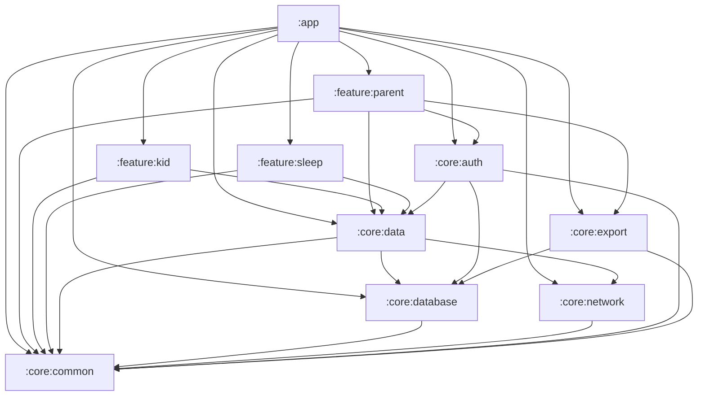
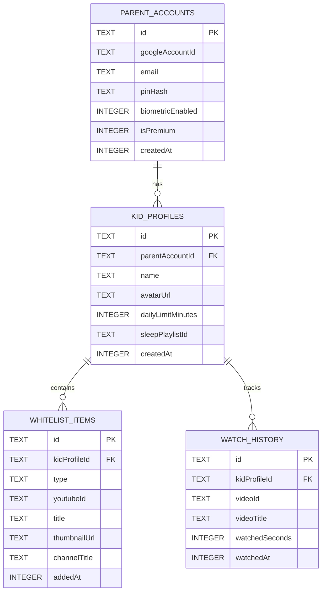
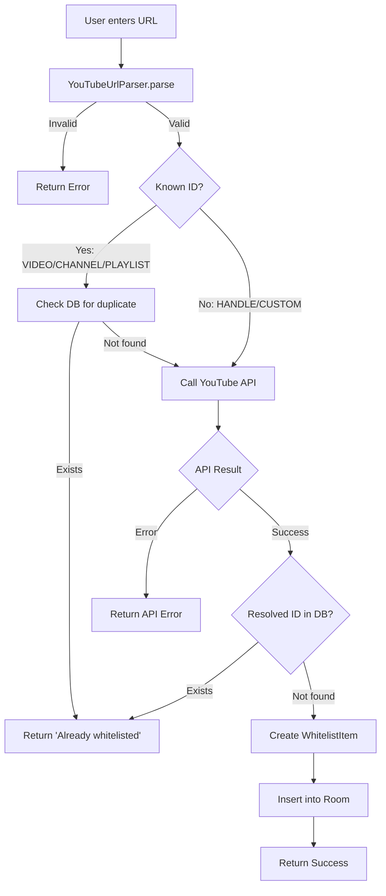
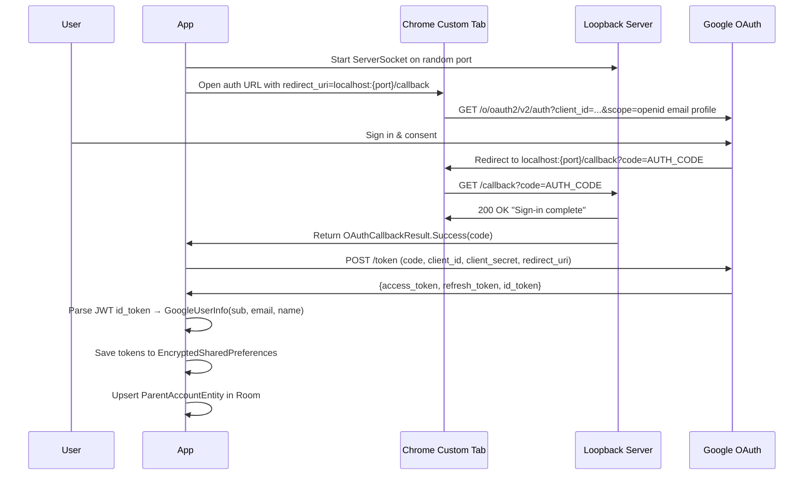
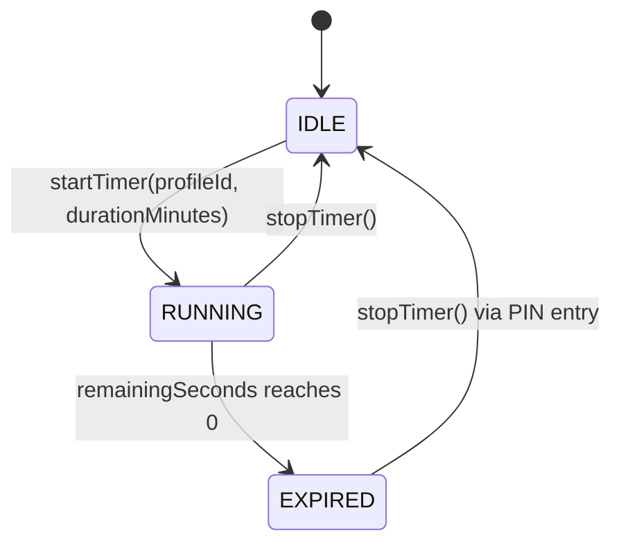

# Low-Level Design (LLD)

**Project**: YouTubeWhitelist
**Version**: 1.0.0
**Last Updated**: 2026-02-10

---

## Table of Contents

1. [Module Dependency Graph](#1-module-dependency-graph)
2. [Database Schema](#2-database-schema)
3. [Data Layer Architecture](#3-data-layer-architecture)
4. [Network Layer](#4-network-layer)
5. [Authentication & Security](#5-authentication--security)
6. [Dependency Injection](#6-dependency-injection)
7. [Sleep Timer & Time Limit](#7-sleep-timer--time-limit)
8. [Export/Import](#8-exportimport)
9. [WebView Architecture](#9-webview-architecture)
10. [ProGuard/R8 Rules](#10-proguardr8-rules)
11. [Key Design Patterns](#11-key-design-patterns)

---

## 1. Module Dependency Graph

The project consists of 10 Gradle modules organized in three layers: app, feature, and core.



### Module Responsibility Matrix

| Module | Responsibility | Plugins |
|--------|---------------|---------|
| `:app` | Main Activity, navigation graph, DI entry point, BuildConfig credentials | application, compose, serialization, ksp, hilt |
| `:feature:parent` | Parent mode UI: dashboard, WebView browser, whitelist manager, profiles, stats, about | library, compose, ksp, hilt |
| `:feature:kid` | Kid mode UI: home grid, channel/playlist detail, video player, search | library, compose, ksp, hilt |
| `:feature:sleep` | Sleep mode UI: timer setup screen | library, compose, ksp, hilt |
| `:core:common` | Shared utilities: AppResult, WhitelistItemType, YouTubeUrlParser, theme, dispatcher qualifiers | library, compose, ksp, hilt |
| `:core:data` | Repository interfaces + implementations, domain models, SleepTimerManager, TimeLimitChecker | library, ksp, hilt |
| `:core:database` | Room database, entities, DAOs, DatabaseModule | library, ksp, hilt |
| `:core:network` | Retrofit API service, DTOs, OkHttp config, NetworkModule | library, serialization, ksp, hilt |
| `:core:auth` | OAuth flow, PIN hashing, brute force protection, token storage, AuthModule | library, ksp, hilt |
| `:core:export` | JSON export/import service, export DTOs | library, serialization, ksp, hilt |

---

## 2. Database Schema

### Overview

- **Database name**: `youtubewhitelist.db`
- **Room version**: 2
- **Migration strategy**: `fallbackToDestructiveMigration()` (no explicit migrations)
- **Entities**: 4
- **DAOs**: 4

### ER Diagram



### Entity Details

#### ParentAccountEntity

| Column | Type | Nullable | Default | Notes |
|--------|------|----------|---------|-------|
| `id` | TEXT | No | — | **PK**, UUID |
| `googleAccountId` | TEXT | No | — | Google `sub` claim |
| `email` | TEXT | No | — | Google email |
| `pinHash` | TEXT | No | — | Format: `base64(salt):base64(hash)` |
| `biometricEnabled` | INTEGER | No | `false` | Boolean |
| `isPremium` | INTEGER | No | `false` | Boolean |
| `createdAt` | INTEGER | No | `currentTimeMillis()` | Epoch ms |

#### KidProfileEntity

| Column | Type | Nullable | Default | Notes |
|--------|------|----------|---------|-------|
| `id` | TEXT | No | — | **PK**, UUID |
| `parentAccountId` | TEXT | No | — | **FK** → `parent_accounts(id)`, CASCADE |
| `name` | TEXT | No | — | Profile display name |
| `avatarUrl` | TEXT | Yes | `null` | Optional avatar URL |
| `dailyLimitMinutes` | INTEGER | Yes | `null` | null = unlimited |
| `sleepPlaylistId` | TEXT | Yes | `null` | YouTube playlist ID for sleep mode |
| `createdAt` | INTEGER | No | `currentTimeMillis()` | Epoch ms |

**Indices**: `parentAccountId`

#### WhitelistItemEntity

| Column | Type | Nullable | Default | Notes |
|--------|------|----------|---------|-------|
| `id` | TEXT | No | — | **PK**, UUID |
| `kidProfileId` | TEXT | No | — | **FK** → `kid_profiles(id)`, CASCADE |
| `type` | TEXT | No | — | Enum: `CHANNEL`, `VIDEO`, `PLAYLIST` |
| `youtubeId` | TEXT | No | — | YouTube content ID |
| `title` | TEXT | No | — | Content title |
| `thumbnailUrl` | TEXT | No | — | Thumbnail image URL |
| `channelTitle` | TEXT | Yes | `null` | Channel name (null for CHANNEL type) |
| `addedAt` | INTEGER | No | `currentTimeMillis()` | Epoch ms |

**Indices**:
- `kidProfileId` (simple)
- `(kidProfileId, type)` (composite, for type filtering)
- `(kidProfileId, youtubeId)` (**unique**, prevents duplicate whitelisting)

#### WatchHistoryEntity

| Column | Type | Nullable | Default | Notes |
|--------|------|----------|---------|-------|
| `id` | TEXT | No | — | **PK**, UUID |
| `kidProfileId` | TEXT | No | — | **FK** → `kid_profiles(id)`, CASCADE |
| `videoId` | TEXT | No | — | YouTube video ID |
| `videoTitle` | TEXT | No | — | Video title at watch time |
| `watchedSeconds` | INTEGER | No | — | Duration watched |
| `watchedAt` | INTEGER | No | `currentTimeMillis()` | Epoch ms |

**Indices**:
- `kidProfileId` (simple)
- `(kidProfileId, watchedAt)` (composite, for time-range queries)

### DAO Method Inventory

#### ParentAccountDao (5 methods)

| Method | Return Type | Query Type |
|--------|-------------|------------|
| `getParentAccount()` | `Flow<ParentAccountEntity?>` | SELECT LIMIT 1 |
| `getParentAccountOnce()` | `suspend ParentAccountEntity?` | SELECT LIMIT 1 |
| `insert(account)` | `suspend Unit` | INSERT REPLACE |
| `update(account)` | `suspend Unit` | UPDATE |
| `deleteAll()` | `suspend Unit` | DELETE all |

#### KidProfileDao (7 methods)

| Method | Return Type | Query Type |
|--------|-------------|------------|
| `getProfilesByParent(parentId)` | `Flow<List<KidProfileEntity>>` | SELECT ORDER BY createdAt |
| `getProfileById(profileId)` | `Flow<KidProfileEntity?>` | SELECT WHERE id |
| `getProfileByIdOnce(profileId)` | `suspend KidProfileEntity?` | SELECT WHERE id |
| `getProfileCount(parentId)` | `suspend Int` | COUNT |
| `insert(profile)` | `suspend Unit` | INSERT REPLACE |
| `update(profile)` | `suspend Unit` | UPDATE |
| `delete(profile)` | `suspend Unit` | DELETE |

#### WhitelistItemDao (17 methods)

| Method | Return Type | Query Type | Notes |
|--------|-------------|------------|-------|
| `getItemsByProfile(profileId)` | `Flow<List<...>>` | SELECT ORDER BY addedAt DESC | All items |
| `getItemsByProfileAndType(profileId, type)` | `Flow<List<...>>` | SELECT WHERE type | Type filter |
| `findByYoutubeId(profileId, youtubeId)` | `suspend Entity?` | SELECT LIMIT 1 | Duplicate check |
| `getItemCount(profileId)` | `suspend Int` | COUNT | |
| `getYoutubeIdsByType(profileId, type)` | `suspend List<String>` | SELECT youtubeId | IDs only (quota-safe) |
| `insert(item)` | `suspend Unit` | INSERT REPLACE | |
| `insertAll(items)` | `suspend Unit` | INSERT REPLACE | Batch |
| `delete(item)` | `suspend Unit` | DELETE | |
| `deleteAllByProfile(profileId)` | `suspend Unit` | DELETE WHERE profile | |
| `getChannelsByProfile(profileId)` | `Flow<List<...>>` | SELECT WHERE 'CHANNEL' | Sorted by title |
| `getVideosByProfile(profileId)` | `Flow<List<...>>` | SELECT WHERE 'VIDEO' | Sorted by addedAt |
| `getPlaylistsByProfile(profileId)` | `Flow<List<...>>` | SELECT WHERE 'PLAYLIST' | Sorted by title |
| `getVideosByChannelTitle(profileId, channelTitle)` | `Flow<List<...>>` | SELECT WHERE channelTitle | Channel detail view |
| `searchItems(profileId, query)` | `Flow<List<...>>` | SELECT LIKE title OR channelTitle | Full-text search |
| `getItemById(itemId)` | `Flow<Entity?>` | SELECT WHERE id | Detail view |

#### WatchHistoryDao (9 methods)

| Method | Return Type | Query Type | Notes |
|--------|-------------|------------|-------|
| `getRecentHistory(profileId, limit=50)` | `Flow<List<...>>` | SELECT ORDER BY watchedAt DESC LIMIT | |
| `getTotalWatchedSeconds(profileId, sinceTimestamp)` | `suspend Int?` | SUM(watchedSeconds) | Nullable |
| `getTodayHistory(profileId, startOfDay)` | `Flow<List<...>>` | SELECT WHERE watchedAt >= startOfDay | |
| `insert(entry)` | `suspend Unit` | INSERT | |
| `deleteAllByProfile(profileId)` | `suspend Unit` | DELETE WHERE profile | |
| `deleteOlderThan(beforeTimestamp)` | `suspend Unit` | DELETE WHERE watchedAt < | Cleanup |
| `getVideosWatchedCount(profileId, sinceTimestamp)` | `suspend Int` | COUNT DISTINCT videoId | |
| `getDailyWatchTime(profileId, sinceTimestamp)` | `suspend List<DailyWatchAggregate>` | GROUP BY day | Day = `watchedAt / 86400000 * 86400000` |
| `getTotalWatchedSecondsFlow(profileId, sinceTimestamp)` | `Flow<Int>` | COALESCE(SUM, 0) | Non-nullable Flow |

---

## 3. Data Layer Architecture

### Three-Layer Mapping

```
YouTube API (JSON)
    ↓  Retrofit + kotlinx-serialization
DTO Layer (core:network)
    ↓  RepositoryImpl.toDomain()
Domain Model (core:data/model)
    ↓  RepositoryImpl.toEntity()
Entity Layer (core:database)
    ↓  Room
SQLite Database
```

| Layer | Location | Example Class | Purpose |
|-------|----------|---------------|---------|
| DTO | `core.network.dto` | `ChannelDto`, `VideoDto` | API response deserialization |
| Domain | `core.data.model` | `YouTubeMetadata.Channel`, `WhitelistItem` | Business logic, UI consumption |
| Entity | `core.database.entity` | `WhitelistItemEntity` | Database persistence |

### Domain Models

| Model | Fields | Location |
|-------|--------|----------|
| `ParentAccount` | id, googleAccountId, email, isPinSet, biometricEnabled, isPremium, createdAt | `core.data.model` |
| `KidProfile` | id, parentAccountId, name, avatarUrl, dailyLimitMinutes, sleepPlaylistId, createdAt | `core.data.model` |
| `WhitelistItem` | id, kidProfileId, type, youtubeId, title, thumbnailUrl, channelTitle, addedAt | `core.data.model` |
| `WatchHistory` | id, kidProfileId, videoId, videoTitle, watchedSeconds, watchedAt | `core.data.model` |
| `WatchStats` | totalWatchedSeconds, videosWatchedCount, dailyBreakdown | `core.data.model` |
| `PlaylistVideo` | videoId, title, thumbnailUrl, channelTitle, position | `core.data.model` |
| `YouTubeMetadata` | Sealed: Channel, Video, Playlist (shared: youtubeId, title, thumbnailUrl) | `core.data.model` |
| `AuthState` | Sealed: Loading, Authenticated(account), Unauthenticated | `core.data.model` |
| `PinVerificationResult` | Sealed: Success, Failure(attemptsRemaining), LockedOut(remainingSeconds) | `core.data.model` |

### Repository Interfaces

#### AuthRepository
```kotlin
interface AuthRepository {
    val authState: StateFlow<AuthState>
    suspend fun signIn(activityContext: Context)
    suspend fun signOut()
    suspend fun checkAuthState()
}
```

#### PinRepository
```kotlin
interface PinRepository {
    suspend fun setupPin(pin: String)
    suspend fun verifyPin(pin: String): PinVerificationResult
    suspend fun changePin(oldPin: String, newPin: String): PinVerificationResult
    suspend fun isPinSet(): Boolean
}
```

#### ParentAccountRepository
```kotlin
interface ParentAccountRepository {
    fun getAccount(): Flow<ParentAccount?>
    suspend fun hasAccount(): Boolean
}
```

#### KidProfileRepository
```kotlin
interface KidProfileRepository {
    fun getProfilesByParent(parentId: String): Flow<List<KidProfile>>
    fun getProfileById(profileId: String): Flow<KidProfile?>
    suspend fun createProfile(parentId: String, name: String, avatarUrl: String?): KidProfile
    suspend fun updateProfile(profile: KidProfile)
    suspend fun deleteProfile(profileId: String)
    suspend fun getProfileCount(parentId: String): Int
}
```

#### WhitelistRepository
```kotlin
interface WhitelistRepository {
    fun getItemsByProfile(profileId: String): Flow<List<WhitelistItem>>
    fun getItemsByProfileAndType(profileId: String, type: WhitelistItemType): Flow<List<WhitelistItem>>
    suspend fun addItemFromUrl(profileId: String, url: String): AppResult<WhitelistItem>
    suspend fun removeItem(item: WhitelistItem)
    suspend fun isAlreadyWhitelisted(profileId: String, youtubeId: String): Boolean
    suspend fun getItemCount(profileId: String): Int
    fun getChannelsByProfile(profileId: String): Flow<List<WhitelistItem>>
    fun getVideosByProfile(profileId: String): Flow<List<WhitelistItem>>
    fun getPlaylistsByProfile(profileId: String): Flow<List<WhitelistItem>>
    fun getVideosByChannelTitle(profileId: String, channelTitle: String): Flow<List<WhitelistItem>>
    fun searchItems(profileId: String, query: String): Flow<List<WhitelistItem>>
    fun getItemById(itemId: String): Flow<WhitelistItem?>
    suspend fun getChannelYoutubeIds(profileId: String): List<String>
}
```

#### YouTubeApiRepository
```kotlin
interface YouTubeApiRepository {
    suspend fun getChannelById(channelId: String): AppResult<YouTubeMetadata.Channel>
    suspend fun getChannelByHandle(handle: String): AppResult<YouTubeMetadata.Channel>
    suspend fun getVideoById(videoId: String): AppResult<YouTubeMetadata.Video>
    suspend fun getPlaylistById(playlistId: String): AppResult<YouTubeMetadata.Playlist>
    suspend fun getPlaylistItems(playlistId: String): AppResult<List<PlaylistVideo>>
    suspend fun searchVideosInChannel(channelId: String, query: String): AppResult<List<PlaylistVideo>>
}
```

#### WatchHistoryRepository
```kotlin
interface WatchHistoryRepository {
    suspend fun recordWatch(profileId: String, videoId: String, videoTitle: String, watchedSeconds: Int)
    fun getRecentHistory(profileId: String, limit: Int = 50): Flow<List<WatchHistory>>
    suspend fun getWatchStats(profileId: String, sinceTimestamp: Long): WatchStats
    suspend fun getTotalWatchedSecondsToday(profileId: String): Int
    fun getTotalWatchedSecondsTodayFlow(profileId: String): Flow<Int>
}
```

### URL Parsing Flow

The `WhitelistRepositoryImpl.addItemFromUrl()` method implements a two-phase duplicate detection strategy:



**YouTube URL patterns supported**:
| Pattern | Type | Example |
|---------|------|---------|
| `youtu.be/{id}` | VIDEO | `youtu.be/dQw4w9WgXcQ` |
| `/watch?v={id}` | VIDEO | `youtube.com/watch?v=dQw4w9WgXcQ` |
| `/shorts/{id}` | VIDEO | `youtube.com/shorts/abc123` |
| `/embed/{id}` | VIDEO | `youtube.com/embed/abc123` |
| `/live/{id}` | VIDEO | `youtube.com/live/abc123` |
| `/channel/{id}` | CHANNEL | `youtube.com/channel/UCxxxx` |
| `/@{handle}` | CHANNEL_HANDLE | `youtube.com/@mkbhd` |
| `/c/{name}` | CHANNEL_CUSTOM | `youtube.com/c/CustomName` |
| `/playlist?list={id}` | PLAYLIST | `youtube.com/playlist?list=PLxxxx` |
| `/watch?v=...&list={id}` | PLAYLIST | Watch URL with playlist |

---

## 4. Network Layer

### YouTube API Service

Base URL: `https://www.googleapis.com/youtube/v3/`

```kotlin
interface YouTubeApiService {
    @GET("channels")
    suspend fun getChannels(
        @Query("part") part: String = "snippet,contentDetails,statistics",
        @Query("id") id: String? = null,
        @Query("forHandle") forHandle: String? = null
    ): Response<YouTubeListResponse<ChannelDto>>

    @GET("videos")
    suspend fun getVideos(
        @Query("part") part: String = "snippet,contentDetails",
        @Query("id") id: String
    ): Response<YouTubeListResponse<VideoDto>>

    @GET("playlists")
    suspend fun getPlaylists(
        @Query("part") part: String = "snippet",
        @Query("id") id: String
    ): Response<YouTubeListResponse<PlaylistDto>>

    @GET("playlistItems")
    suspend fun getPlaylistItems(
        @Query("part") part: String = "snippet",
        @Query("playlistId") playlistId: String,
        @Query("maxResults") maxResults: Int = 50,
        @Query("pageToken") pageToken: String? = null
    ): Response<YouTubeListResponse<PlaylistItemDto>>

    @GET("search")
    suspend fun search(
        @Query("part") part: String = "snippet",
        @Query("channelId") channelId: String? = null,
        @Query("q") query: String? = null,
        @Query("type") type: String = "video",
        @Query("maxResults") maxResults: Int = 25,
        @Query("pageToken") pageToken: String? = null
    ): Response<YouTubeListResponse<SearchResultDto>>
}
```

### DTO Hierarchy

```
YouTubeListResponse<T>
├── kind: String?
├── etag: String?
├── pageInfo: PageInfo? (totalResults, resultsPerPage)
├── nextPageToken: String?
├── prevPageToken: String?
└── items: List<T>

ChannelDto
├── id: String (required)
├── snippet: ChannelSnippet? (title, description, customUrl, thumbnails, publishedAt)
├── contentDetails: ChannelContentDetails? → RelatedPlaylists? (likes, uploads)
└── statistics: ChannelStatistics? (viewCount, subscriberCount, videoCount)

VideoDto
├── id: String (required)
├── snippet: VideoSnippet? (title, description, channelId, channelTitle, thumbnails, publishedAt)
└── contentDetails: VideoContentDetails? (duration as ISO8601)

PlaylistDto
├── id: String (required)
└── snippet: PlaylistSnippet? (title, description, channelId, channelTitle, thumbnails)

PlaylistItemDto
└── snippet: PlaylistItemSnippet? (title, channelTitle, thumbnails, resourceId → videoId, position)

SearchResultDto
├── id: SearchResultId? (kind, videoId?, channelId?, playlistId?)
└── snippet: SearchSnippet? (title, description, channelTitle, thumbnails)

ThumbnailSet
├── default: Thumbnail? (120×90)
├── medium: Thumbnail? (320×180)
├── high: Thumbnail? (480×360)
├── standard: Thumbnail? (640×480)
└── maxres: Thumbnail? (1280×720)
```

### OkHttp Configuration

```
OkHttpClient
├── ApiKeyInterceptor (always active)
│   └── Adds ?key={YOUTUBE_API_KEY} to every request
└── HttpLoggingInterceptor (debug only, Level.BASIC)
    └── Disabled in release to prevent API key leaks in logs
```

### Serialization Configuration

```kotlin
Json {
    ignoreUnknownKeys = true   // Forward-compatible with YouTube API changes
    coerceInputValues = true   // Handles type mismatches gracefully
}
```

Converter: `kotlinx-serialization` via `json.asConverterFactory("application/json")`

### API Quota Table

| Endpoint | Quota Cost | Max Results | Notes |
|----------|-----------|-------------|-------|
| `channels` | 1 unit | — | By ID or forHandle |
| `videos` | 1 unit | — | Comma-separated IDs |
| `playlists` | 1 unit | — | Comma-separated IDs |
| `playlistItems` | 1 unit | 50/page | Paginated |
| `search` | **100 units** | 25 default, 10 for channel search | Expensive! |

**Daily quota**: 10,000 units. Channel video search limited to max 3 channels per query (300 units max).

---

## 5. Authentication & Security

### OAuth 2.0 Flow



**Key implementation details**:
- OAuth client type: **Web application** (not Android) — required for Authorization Code flow
- Redirect URI: `http://localhost/callback` (Google allows any port for loopback per RFC 8252 §7.3)
- Server timeout: 5 minutes (300,000ms)
- Chrome Custom Tabs (not WebView): Google blocks OAuth in embedded WebViews since 2016
- `bringAppToForeground()`: Launches main activity with `FLAG_ACTIVITY_SINGLE_TOP | FLAG_ACTIVITY_CLEAR_TOP`

### PIN Security

**Algorithm**: PBKDF2WithHmacSHA256

| Parameter | Value |
|-----------|-------|
| Algorithm | `PBKDF2WithHmacSHA256` |
| Iterations | 120,000 |
| Key length | 256 bits |
| Salt length | 16 bytes |
| Salt generation | `SecureRandom` |
| Storage format | `base64(salt):base64(hash)` |
| Comparison | `MessageDigest.isEqual()` (constant-time) |

### Brute Force Protection

| Config | Value |
|--------|-------|
| Threshold | 5 attempts before first lockout |
| Base lockout | 30 seconds |
| Escalation | Exponential: `30s × 2^(tier-1)` |
| Storage | `SharedPreferences("pin_brute_force")` |
| Keys | `pin_fail_count`, `pin_lockout_until` |

**Lockout schedule**:

| Failed Attempts | Lockout Duration |
|----------------|-----------------|
| 5 | 30 seconds |
| 10 | 60 seconds |
| 15 | 120 seconds |
| 20 | 240 seconds |
| 25 | 480 seconds |
| 30 | 960 seconds |

### Token Storage

**EncryptedSharedPreferences** (AndroidX Security Crypto):

| Config | Value |
|--------|-------|
| File name | `auth_tokens_encrypted` |
| Master key | `AES256_GCM_SPEC` (Tink) |
| Key encryption | `AES256_SIV` |
| Value encryption | `AES256_GCM` |
| Stored keys | `access_token`, `refresh_token`, `expires_at` |

---

## 6. Dependency Injection

### Hilt Modules (7 total)

#### DispatcherModule (`core:common`)
```kotlin
@Module @InstallIn(SingletonComponent::class)
object DispatcherModule {
    @Provides @IoDispatcher      fun io(): CoroutineDispatcher = Dispatchers.IO
    @Provides @DefaultDispatcher fun default(): CoroutineDispatcher = Dispatchers.Default
    @Provides @MainDispatcher    fun main(): CoroutineDispatcher = Dispatchers.Main
}
```

#### ApiKeyModule (`:app`)
```kotlin
@Module @InstallIn(SingletonComponent::class)
object ApiKeyModule {
    @Provides @YouTubeApiKey      fun apiKey(): String = BuildConfig.YOUTUBE_API_KEY
    @Provides @GoogleClientId     fun clientId(): String = BuildConfig.GOOGLE_CLIENT_ID
    @Provides @GoogleClientSecret fun clientSecret(): String = BuildConfig.GOOGLE_CLIENT_SECRET
}
```

#### NetworkModule (`core:network`)
- `@Provides @Singleton Json` — ignoreUnknownKeys, coerceInputValues
- `@Provides @Singleton OkHttpClient` — ApiKeyInterceptor + debug-only logging
- `@Provides @Singleton Retrofit` — base URL + kotlinx-serialization converter
- `@Provides @Singleton YouTubeApiService` — Retrofit proxy

#### DatabaseModule (`core:database`)
- `@Provides @Singleton YouTubeWhitelistDatabase` — Room.databaseBuilder + fallbackToDestructiveMigration
- `@Provides ParentAccountDao, KidProfileDao, WhitelistItemDao, WatchHistoryDao`

#### AuthModule (`core:auth`)
- `@Binds AuthRepository ← AuthRepositoryImpl`
- `@Binds PinRepository ← PinRepositoryImpl`
- `@Binds ParentAccountRepository ← ParentAccountRepositoryImpl`
- `@Binds TokenManager ← EncryptedTokenManager`
- `@Binds PinHasher ← Pbkdf2PinHasher`
- `@Binds GoogleSignInManager ← GoogleSignInManagerImpl`
- `@Provides BruteForceProtection` — with SharedPreferences("pin_brute_force")

#### DataModule (`core:data`)
- `@Binds YouTubeApiRepository, WhitelistRepository, KidProfileRepository, WatchHistoryRepository, TimeLimitChecker`
- `@Provides @Singleton SleepTimerManager` — with `CoroutineScope(SupervisorJob() + Dispatchers.Default)`

#### ExportModule (`core:export`)
- `@Binds ExportImportService ← ExportImportServiceImpl`

### Qualifier Annotations (7 total)

| Qualifier | Module | Type |
|-----------|--------|------|
| `@IoDispatcher` | `core:common` | `CoroutineDispatcher` |
| `@DefaultDispatcher` | `core:common` | `CoroutineDispatcher` |
| `@MainDispatcher` | `core:common` | `CoroutineDispatcher` |
| `@YouTubeApiKey` | `core:network` | `String` |
| `@GoogleClientId` | `core:auth` | `String` |
| `@GoogleClientSecret` | `core:auth` | `String` |

### AssistedInject Pattern

ViewModels requiring runtime parameters (e.g., `profileId`) use `@AssistedInject`:

```kotlin
@HiltViewModel(assistedFactory = SomeViewModel.Factory::class)
class SomeViewModel @AssistedInject constructor(
    @Assisted("profileId") private val profileId: String,
    private val repository: SomeRepository
) : ViewModel() {
    @AssistedFactory
    interface Factory {
        fun create(@Assisted("profileId") profileId: String): SomeViewModel
    }
}
```

Multiple `@Assisted String` params require `@Assisted("identifier")` to disambiguate.

---

## 7. Sleep Timer & Time Limit

### SleepTimerManager

**Scope**: `@Singleton` with internal `CoroutineScope(SupervisorJob() + Dispatchers.Default)`



**State**: `SleepTimerState`
- `status`: IDLE | RUNNING | EXPIRED
- `profileId`: String? (null when IDLE)
- `totalDurationMinutes`: Int
- `remainingSeconds`: Long (counts down every 1s)
- `formattedRemaining`: computed property ("Xh Ym" or "Xm")

**Integration points**:
- `KidHomeViewModel`: Shows "Good Night" overlay when expired (checks profileId match)
- `VideoPlayerViewModel`: Exits fullscreen + pauses video + shows overlay
- `SleepModeScreen`: Sets timer and navigates to KidHome
- `PinEntry`: Calls `stopTimer()` when PIN verified and timer is EXPIRED

### TimeLimitChecker

**Pattern**: Reactive `combine()` of two data sources

```kotlin
combine(
    kidProfileRepository.getProfileById(profileId),  // Flow<KidProfile?>
    watchHistoryRepository.getTotalWatchedSecondsTodayFlow(profileId)  // Flow<Int>
) → Flow<TimeLimitStatus>
```

**Output**: `TimeLimitStatus`
- `dailyLimitMinutes`: Int? (null = unlimited)
- `watchedTodaySeconds`: Int
- `remainingSeconds`: Int? (null = unlimited)
- `isLimitReached`: Boolean

---

## 8. Export/Import

### JSON Schema

```json
{
  "version": 1,
  "exportedAt": 1707580800000,
  "profiles": [
    {
      "name": "Child Name",
      "avatarUrl": null,
      "dailyLimitMinutes": 60,
      "sleepPlaylistId": null,
      "whitelistItems": [
        {
          "type": "CHANNEL",
          "youtubeId": "UCxxxx",
          "title": "Channel Name",
          "thumbnailUrl": "https://...",
          "channelTitle": null
        }
      ]
    }
  ]
}
```

### Import Strategies

| Strategy | Behavior |
|----------|----------|
| **MERGE** | Keep existing profiles, add new items. Skip duplicates (checked by `youtubeId`). |
| **OVERWRITE** | Delete all existing profiles (cascade deletes items), then import fresh. |

### UUID Regeneration

Import generates new UUIDs for every profile and whitelist item to prevent primary key conflicts between devices.

### ImportResult

```kotlin
data class ImportResult(
    val profilesImported: Int,
    val itemsImported: Int,
    val itemsSkipped: Int  // Duplicates in MERGE mode
)
```

---

## 9. WebView Architecture

### Video Player WebView

**Location**: `feature:kid` — `VideoPlayerScreen.kt`, `SleepModeScreen.kt`

| Setting | Value | Reason |
|---------|-------|--------|
| `javaScriptEnabled` | `true` | Required for IFrame Player API |
| `allowFileAccess` | `false` | Security |
| `allowContentAccess` | `false` | Security |
| `mixedContentMode` | `MIXED_CONTENT_NEVER_ALLOW` | Security |
| `safeBrowsingEnabled` | `true` | Security |
| `shouldOverrideUrlLoading` | returns `true` | Blocks ALL navigation (kid safety) |

**JavaScript Bridges**:
- `VideoEndedBridge`: `@JavascriptInterface onVideoEnded()`, `onEmbedError(errorCode)`
- `SleepVideoEndedBridge`: Same interface for sleep mode

**Embed error handling**: Error codes 101/150 (embedding disabled by video owner) → auto-skip to next video via `viewModel.playNext()`.

**Lifecycle**: `DisposableEffect(youtubeId)` — cleanup on content change:
1. `webView.loadUrl("about:blank")`
2. `webView.stopLoading()`
3. `webView.clearHistory()`
4. `webView.destroy()`

**WebView ref tracking**: `mutableStateOf<WebView?>(null)` (not `mutableListOf` — prevents accumulation on recomposition).

### Browser WebView

**Location**: `feature:parent` — `WebViewBrowserScreen.kt`

| Setting | Value | Reason |
|---------|-------|--------|
| CookieManager | `setAcceptCookie(true)` | YouTube login persistence |
| Third-party cookies | `setAcceptThirdPartyCookies(webView, true)` | YouTube Premium recognition |
| Cookie flush | `CookieManager.flush()` on dispose | Persist cookies to disk |

**Cookie store**: CookieManager is global across app WebViews but separate from Chrome Custom Tabs. Users sign in twice (once for OAuth via CCT, once in Browse YouTube).

---

## 10. ProGuard/R8 Rules

| Category | Rule | Reason |
|----------|------|--------|
| **Kotlinx Serialization** | Keep `*$$serializer`, `Companion`, `serializer()` | Runtime serialization |
| **Navigation Routes** | Keep `Route` sealed class + subclasses | Type-safe nav needs serialization |
| **Export DTOs** | Keep `core.export.model.**` | JSON serialization |
| **YouTube API DTOs** | Keep `core.network.dto.**` | Retrofit + serialization |
| **JavaScript Bridges** | Keep `@JavascriptInterface` methods | WebView bridge reflection |
| **Retrofit** | Keep `YouTubeApiService` methods + annotations | Runtime reflection |
| **OkHttp** | `-dontwarn` platform classes | conscrypt, bouncycastle, openjsse |
| **Room** | Keep entities + DAOs | Reflection-based tools |
| **Tink** | `-dontwarn` ErrorProne annotations | Compile-time only annotations |
| **Kotlin** | Keep `kotlin.Metadata` | Reflection |

---

## 11. Key Design Patterns

### AppResult\<T\> Sealed Interface

```kotlin
sealed interface AppResult<out T> {
    data class Success<T>(val data: T) : AppResult<T>
    data class Error(val message: String, val exception: Throwable? = null) : AppResult<Nothing>
}
```

Extension functions: `map()`, `onSuccess()`, `onError()`, `getOrNull()`

### Flow Combining Patterns

**5-flow combine** (Kotlin native):
```kotlin
combine(flow1, flow2, flow3, flow4, flow5) { a, b, c, d, e -> ... }
```

**6+ flows** (nested combine):
```kotlin
combine(
    flow1, flow2, flow3, flow4,
    combine(flow5, flow6) { e, f -> Pair(e, f) }
) { a, b, c, d, pair -> ... }
```

### Debounce + flatMapLatest Search Pattern

```kotlin
queryFlow
    .debounce(300)
    .flatMapLatest { query ->
        if (query.isBlank()) flowOf(emptyList())
        else repository.searchItems(profileId, query)
    }
    .stateIn(viewModelScope, SharingStarted.Eagerly, emptyList())
```

**TextField** uses non-debounced `queryFlow.asStateFlow()` for immediate input feedback. Debounced state drives only search results.

### Manual Job Tracking for Cancellable Side-Effects

```kotlin
private var searchJob: Job? = null

queryFlow.debounce(300).flatMapLatest { query ->
    searchJob?.cancel()
    searchJob = viewModelScope.launch {
        // Fire-and-forget API call
        val results = apiRepository.searchVideosInChannel(channelId, query)
        _channelVideoResults.value = results.getOrNull() ?: emptyList()
    }
    // Local DB search (reactive)
    repository.searchItems(profileId, query)
}
```

`flatMapLatest` cancels the Flow but NOT side-effect Jobs — explicit cancellation needed.

### Thumbnail URL Selection

```kotlin
fun ThumbnailSet?.bestUrl(): String =
    this?.high?.url ?: this?.medium?.url ?: this?.default?.url ?: ""
```

Cascading fallback: high → medium → default → empty string.
